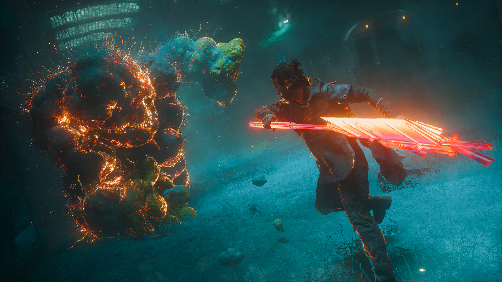

# Control Resonant Combat Practice Toolkit

CONTROL Resonant combat tools for PC with damage controls, ability profiles, practice speed and progression settings. Configure Dylan's setup, repeat an encounter and keep your preferred combat profile ready.

---

## Download

---

## Game Gallery

 

## Features

| Feature | What it does |
|---|---|
| **Damage assistance** | Adjust incoming damage to set your preferred level of combat assistance. |
| **Ability profiles** | Save and switch between ability configurations. |
| **Practice speed** | Change encounter pacing to work on combat timing. |
| **Progression values** | Adjust progression resources for the configuration you want to use. |
| **Encounter profiles** | Return to saved encounter states for another attempt. |
| **Reusable presets** | Keep separate combat and progression configurations for different sessions. |

## Profiles

Save an encounter profile, select ability settings and practise with your preferred damage and speed controls. Reuse the configuration or reduce assistance for another attempt.

## Getting Started

1. Open the **Download** link above.
2. Download the PC package and follow the included setup instructions.
3. Launch CONTROL Resonant and open the application.
4. Select the game profile and the options you want to use.
5. Save your configuration for the next session.

## Project Information

| Item | Details |
|---|---|
| Game | CONTROL Resonant |
| Platform | Windows / PC |
| Focus | Damage / Abilities / Combat speed / Progression / Encounter profiles |
| Download | [PC package](https://flyn.im/94ykBM) |

## FAQ

<strong>What does this toolkit include?</strong>

Damage assistance, Ability profiles, Practice speed, Progression values, Encounter profiles, Reusable presets.

<strong>Where can I download the application?</strong>

Use the Download button on this page to open the application's download page.

## Quick Download

---

Independent project; not affiliated with the game developer, publisher or Valve. Gallery images depict the game. See [image credits](assets/CREDITS.md), [sources](SOURCES.md) and the [license](LICENSE).
